# Basic Inventory Management System

## Table of Contents
1. [Overview](#overview)
2. [Features](#features)
3. [Tools & Technologies](#tools--technologies)
4. [Project Structure](#project-structure)
5. [Database Setup](#database-setup)
6. [Installation and Setup](#installation-and-setup)
7. [API Endpoints](#api-endpoints)
8. [Contributing](#contributing)
9. [Contact](#contact)
10. [License](#license)

## Overview

Basic Inventory Management System(BIMS) is a software application designed to help businesses track and manage their inventory efficiently. It allows users to monitor stock levels, manage product data, process orders,maintain accurate records of goods. 

## Key Features

### 1. Authentication & Authorization
- Secure user authentication and registration utilizing the Identity library.
### 2. Role-Based Access Control
- Assign predefined roles such as **Superadmin**, **Admin**, **Manager**, and **User**.
- Role-based access ensures users have appropriate permissions based on their roles.

### 3. Product Management
- **Add, Edit, & Delete Products**
- **Inventory Status Report**: Monitor stock levels.
- **Search Product**: Search products by category or product name
- **Pagination**: Navigation through large product lists with paginated views.

### 4. Sales Management
- **Add, Edit, & Delete Sales**
- **Sales Report**: Generate reports for sales within the current month, with an option to download as CSV.
- **Search Sale**: Search sales by product name or category.
- **Pagination**: Navigation through large sales lists with paginated views.

### 5. Purchase Management
- **Add, Edit, & Delete Purchases**
- **Purchase Report**: Report of purchases for the current month, with an option to download as CSV.
- **Search Purchase**: Search purchase records by product name or category.
- **Pagination**: Navigation through large purchases lists with paginated views.

### 6. Category Management
- **Add, Edit, & Delete Categories**
- **Search Categories**
- **Pagination**: Navigate large category lists.

### 7. Role Management
- **Add, Edit, & Delete Roles**: Create, modify, or remove user roles as needed.

### 8. Role Assignment
- Assign roles to users to control their access and functionality within the system.

### 9.Dashboard
- Dashboard displaying key metrics, including total products, sales quantity, stock quantity, and purchase quantity.

### 10. User Profile
- Personal profile which include  user details & logout option.

## Tools & Technologies
- **Language**: C#
- **Framework**: ASP.NET Core(version 8.0)
- **Database**: MSSQL
- **ORM**: Entity Framework
- **Frontend**: HTML,CSS,Bootstrap & Jquery
- **logging library**: Serilog
- **IDE**: Visual Studio 2022


## Database Setup

1. **Create Database**:
   ```sql
   CREATE DATABASE Basic_Inventory_Management_System;
   ```
   **Also can Import My Database into Sql Server**


## Installation and Setup

1. **Clone the Repository**:
   To get a copy of the project, clone the repository using Git
   ```bash
   git clone https://github.com/Md-Roni024/BasicInventoryManagementSystem
   ```

2. **Go to Sql Server**:
   ```bash
   Finde my given database 'Basic_Inventory_Management_System' which is in Backup Database'folder.

   Now Import it in your database
   ```

3. **Navigate to the project directory where program.cs file present**:
   ```bash
   cd BasicInventoryManagementSystem
   or Go to directory where Program.cs
   ```

4. **Run the Project**:
   ```
   Run the project using Visual studio run option.
   ```

## User Login Credentials
   ```bash
    #Super Admin: 100% access
    Email: super@gmail.com
    Password: super@123

    #Admin: Less access than Super admin
    Email: admin@gmail.com
    Password: admin@123

    #User: Limited Access
    Email: user@gmail.com
    Password: user@123

   ```
## Screenshot
1. Login/Registration
   <div style="display: flex; justify-content: space-around;">

   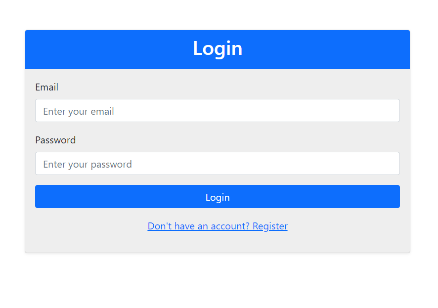
   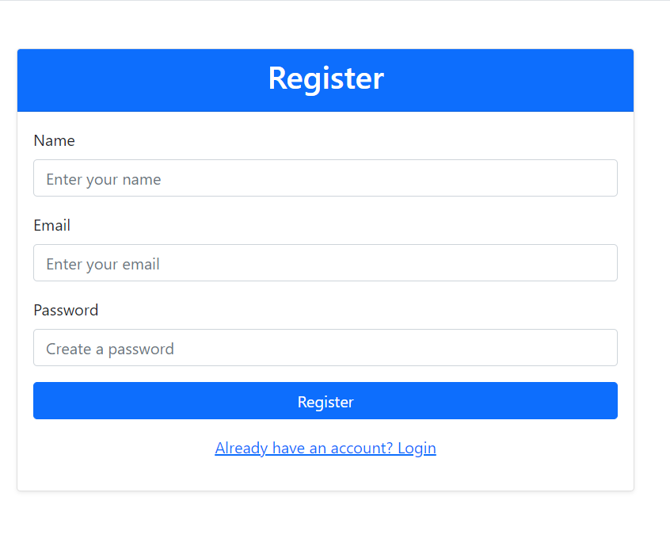

   </div>

2. Home View After Login
      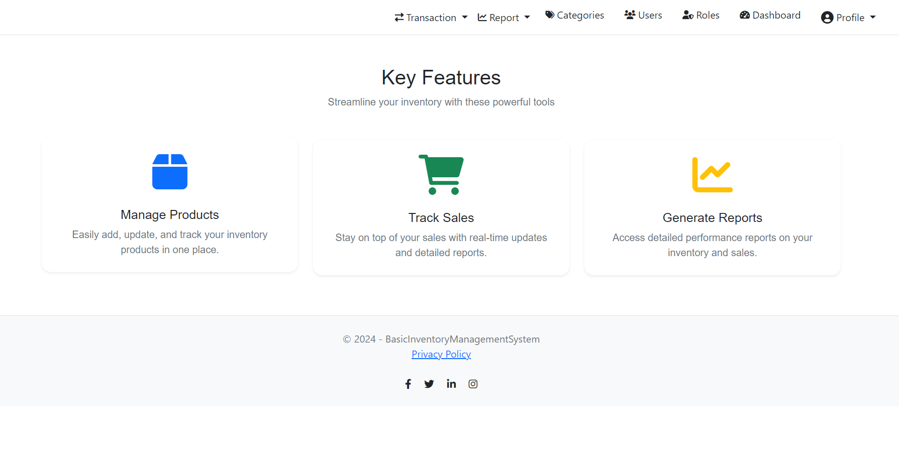

3. Product List, Add Product, Edit Product, Delete Product
   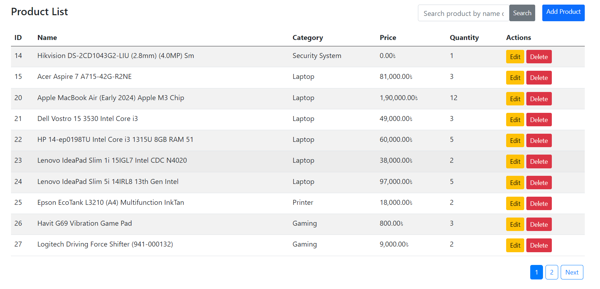
   <div style="display: flex; justify-content: space-around;">
   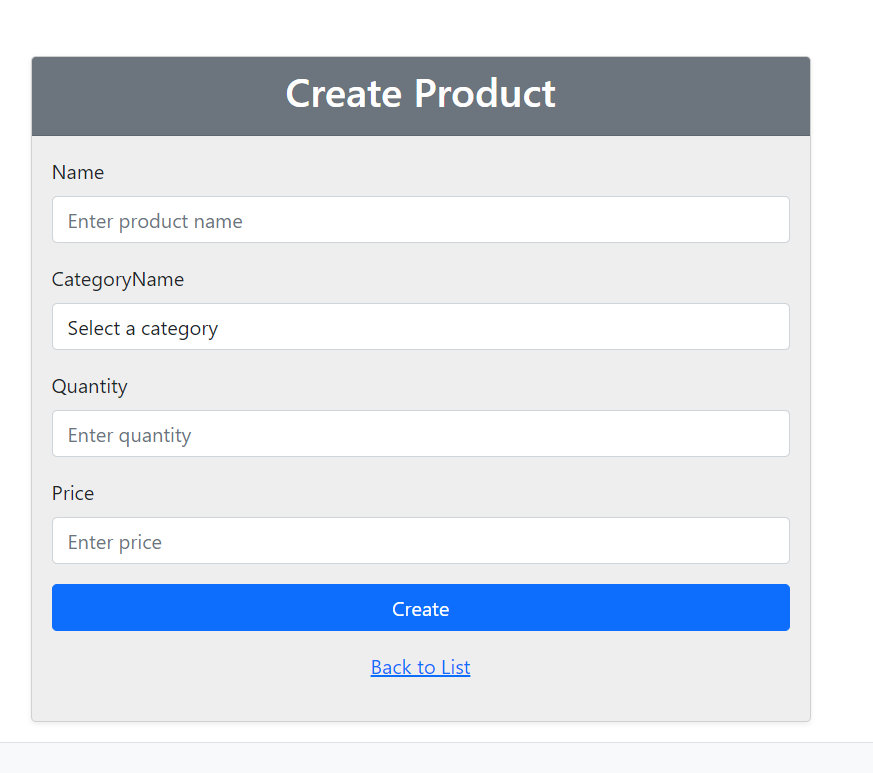
   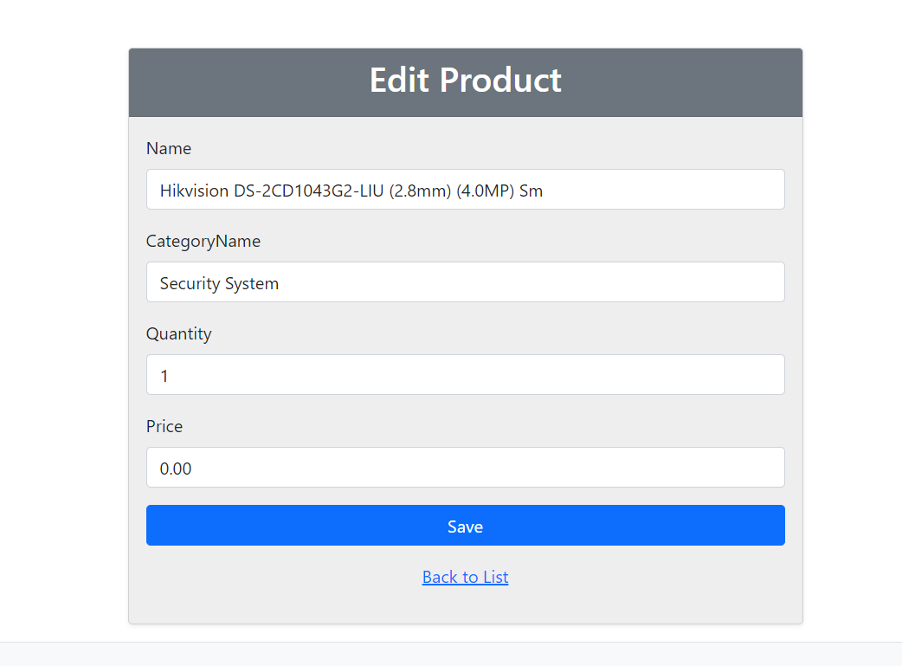

   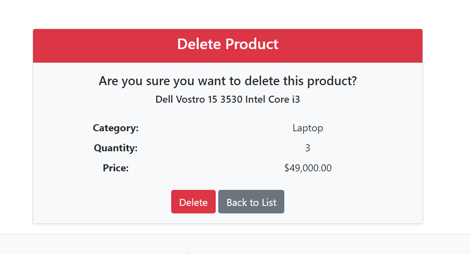
   </div>

3. Sale List, Add Sale, Edit Sale, Delete Sale
   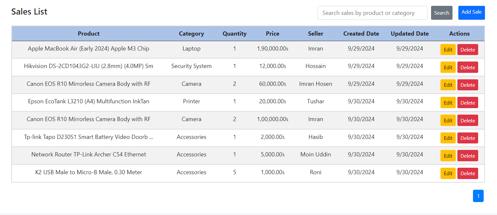
   <div style="display: flex; justify-content: space-around;">
   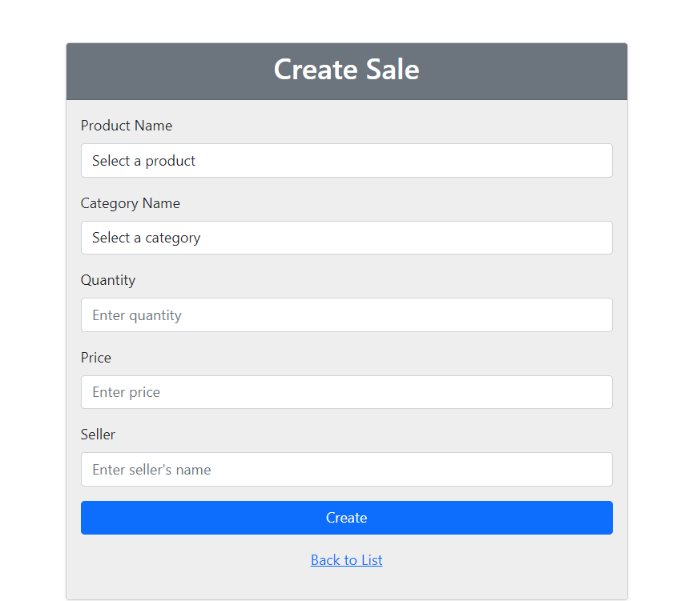
   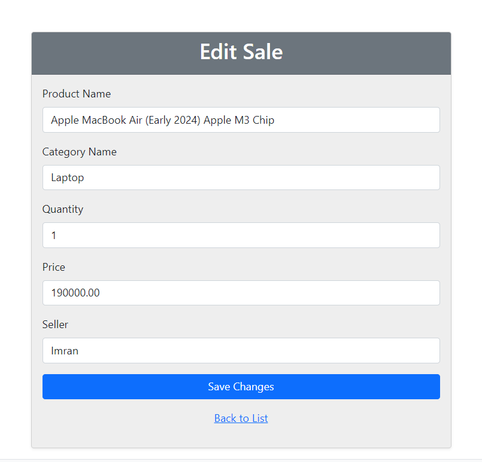

   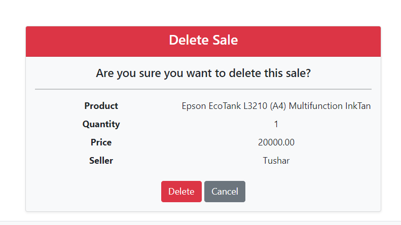
   </div>

4. Generate Report
   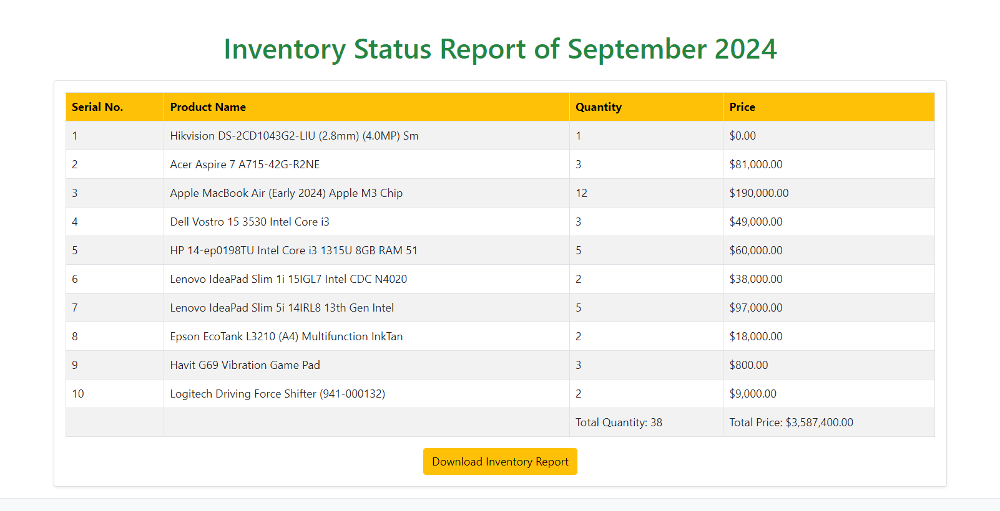

5. Assign Roles
   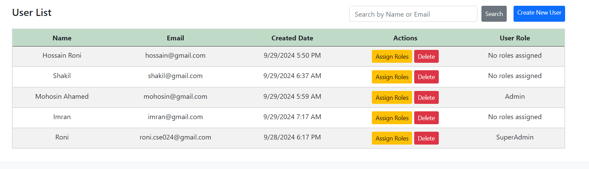

5. Dashboard
   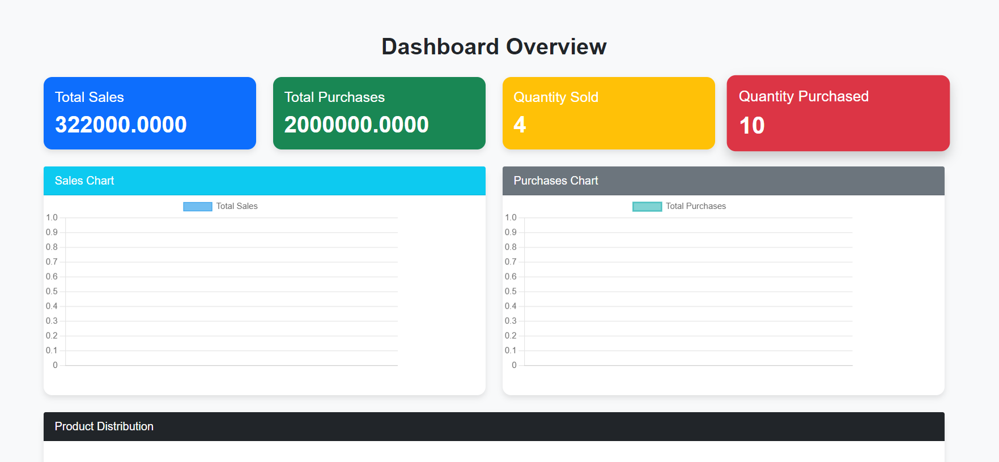

## Contributing
Contributions are welcome! You can help by opening issues for bugs or feature requests and submitting pull requests with your improvements or fixes. Your input will help enhance the project for everyone.

## Contact

For any questions or feedback, please reach out to me at [roni.cse024@gmail.com](mailto:roni.cse024@gmail.com). I appreciate all inquiries and look forward to hearing from you!

## License

Distributed under the MIT License. See `LICENSE.txt` for more information.
